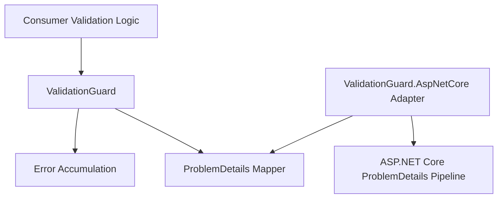
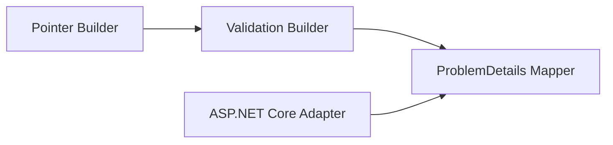
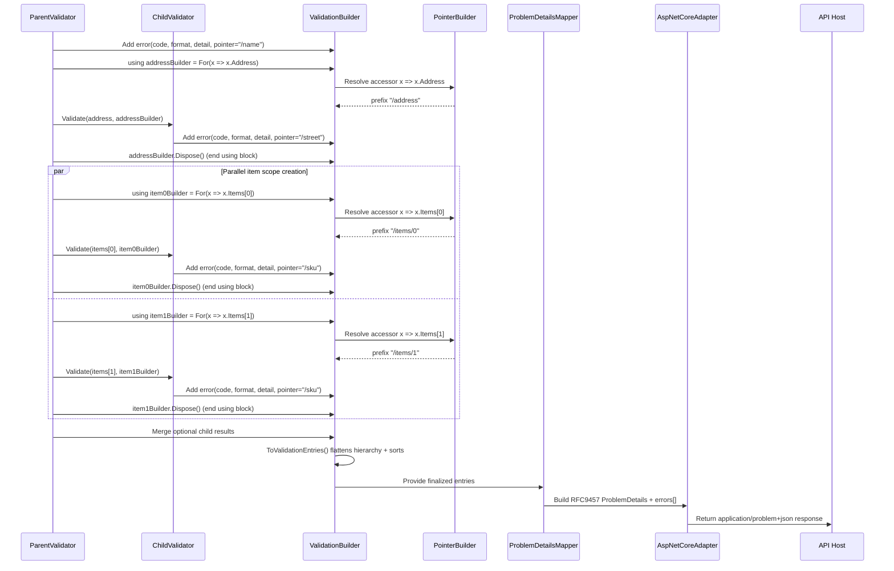

# Technical Design — ValidationGuard Typed Validation Error Accumulator

- [ ] `p3` - **ID**: `cpt-validationguard-design-validation-error-architecture`

## Table of Contents

<!-- generated by `cypilot toc` -->

## 1. Architecture Overview

### 1.1 Architectural Vision

ValidationGuard uses a layered library architecture with a strict separation between validation-domain modeling, accumulation orchestration, RFC 9457 projection, and ASP.NET Core transport integration. The core package is framework-focused and HTTP-agnostic, while the adapter package integrates with ASP.NET Core Problem Details pipelines.

The architecture is optimized for deterministic, machine-readable validation outputs for complex object graphs. Validation failures are accumulated as typed entries and preserved with RFC 6901 JSON Pointer addressing. The output model ensures stable field names (`pointer`, `code`, `format`, `detail`) under the `errors` extension while preserving standard Problem Details behavior.

The design prioritizes compatibility, composability, and predictable evolution. Core contracts are stable and versioned, with all public breaking changes gated behind major versions. Adapter behavior is additive and does not alter core failure semantics.

### 1.2 Architecture Drivers

Requirements that significantly influence architecture decisions.

**ADRs**: `ADR-001` ([Validation builder hierarchy and root-only materialization](./ADR/ADR-001-validation-builder-hierarchy-export.md)).

#### Functional Drivers

| Requirement | Design Response |
|-------------|------------------|
| `cpt-validationguard-fr-typed-error-registration` | Define near-RFC validation entry model with explicit fields: `code`, `format`, `detail`, `pointer`. |
| `cpt-validationguard-fr-nested-object-path-handling` | Provide path composition utility that generates RFC 6901 JSON Pointer for nested object members. |
| `cpt-validationguard-fr-array-element-path-handling` | Support indexed pointer composition for collection traversal (`/items/0/name`). |
| `cpt-validationguard-fr-indexer-keyed-path-handling` | Resolve accessor indexers (`get_Item`) for keyed and numeric segments, RFC 6901-escape keyed tokens, and validate numeric index token correctness. |
| `cpt-validationguard-fr-aggregation-and-merge` | Provide builder/merge contracts that combine child results without dropping entries. |
| `cpt-validationguard-fr-rfc9457-compatible-output` | Store near-RFC validation entries in builder and emit standard Problem Details fields plus extension members with minimal transformation. |
| `cpt-validationguard-fr-errors-extension-projection` | Persist `errors`-ready entries (`pointer`, `code`, `format`, `detail`) and serialize as deterministic extension array. |
| `cpt-validationguard-fr-deterministic-output-ordering` | Normalize ordering strategy before serialization (insertion-order or canonical order policy). |

#### NFR Allocation

| NFR ID | NFR Summary | Allocated To | Design Response | Verification Approach |
|--------|-------------|--------------|-----------------|----------------------|
| `cpt-validationguard-nfr-serialization-performance` | p95 <= 25 ms for 200 failures | ValidationBuilder and mapper layer | Near-RFC entry storage to minimize projection cost and low-allocation envelope construction | Automated performance tests for 200-entry payloads |
| `cpt-validationguard-nfr-memory-efficiency` | O(n) memory growth | ValidationBuilder + mapper pipeline | No retained request graph references; bounded transient allocations proportional to entry count | Memory profiling tests across increasing error counts |
| `cpt-validationguard-nfr-api-stability` | SemVer contract stability | Public contract layer | Versioned contracts and major-only breaking changes | API compatibility checks during CI |

### 1.3 Architecture Layers

- [ ] `p3` - **ID**: `cpt-validationguard-tech-layered-library-architecture`

| Layer | Responsibility | Technology |
|-------|---------------|------------|
| Presentation | API response surface via HTTP Problem Details | ASP.NET Core (`net10.0`) |
| Application | Validation orchestration and result composition | ValidationGuard (`net10.0`) |
| Domain | Validation entry model and pointer semantics | C# records/classes (`net10.0`) |
| Infrastructure | JSON serialization and hosting integration | `System.Text.Json`, ASP.NET Core ProblemDetails |

## 2. Principles & Constraints

### 2.1 Design Principles

#### RFC-First Error Envelope

- [ ] `p2` - **ID**: `cpt-validationguard-principle-rfc-first-envelope`

All transport outputs follow RFC 9457 Problem Details semantics. Validation-specific data is carried only in extension members and never replaces standard Problem Details fields.

**ADRs**: None currently.

#### Stable Error Entry Contract

- [ ] `p2` - **ID**: `cpt-validationguard-principle-stable-error-entry-contract`

Validation entries must preserve a stable contract with `pointer`, `code`, `format`, and `detail` to enable predictable client mapping and long-term compatibility.

**ADRs**: None currently.

### 2.2 Constraints

#### Strict Target Framework Constraint

- [ ] `p2` - **ID**: `cpt-validationguard-constraint-strict-net10-target`

Core and adapter libraries target strictly `net10.0`. No multi-targeting is included in this design scope.

**ADRs**: None currently.

## 3. Technical Architecture

### 3.1 Domain Model

**Technology**: C# domain model types and builder-driven accumulation (`net10.0`).

**Location**: [ValidationGuard core domain model](../src/ValidationGuard)

**Core Entities**:

| Entity | Description | Schema |
|--------|-------------|--------|
| ValidationEntry | Near-RFC validation failure entry with `pointer`, `code`, `format`, `detail`, optional metadata | [ValidationEntry](../src/ValidationGuard) |
| ValidationBuilder | Primary builder/accumulator used during validation traversal and merge operations | [ValidationBuilder](../src/ValidationGuard) |
| ProblemDetailsProjection | Mapping output model for RFC 9457 + `errors` extension | [ProblemDetails mapper](../src/ValidationGuard) |

**Relationships**:
- ValidationBuilder → ValidationEntry: creates and aggregates entries.
- ValidationBuilder → ProblemDetailsProjection: provides finalized, deterministic entries to RFC 9457 projection.

### 3.2 Component Model

#### Pointer Builder

- [ ] `p2` - **ID**: `cpt-validationguard-component-pointer-builder`

##### Why this component exists

Ensures all path addressing is emitted as RFC 6901 JSON Pointer and prevents ad-hoc path string drift.

##### Responsibility scope

Build and normalize pointer segments for properties, array indices, and indexer access (`get_Item`) including escaping rules defined by RFC 6901 and numeric array-index token validation.

##### Responsibility boundaries

Does not perform validation logic or serialization; only pointer composition and normalization.

##### Related components (by ID)

- `cpt-validationguard-component-validation-builder` — called by builder to attach stable pointers.

#### Validation Builder

- [ ] `p2` - **ID**: `cpt-validationguard-component-validation-builder`

##### Why this component exists

Provides the primary accumulation surface for validators and enables merge behavior across nested validation scopes.

##### Responsibility scope

Register entries with `code`, `format`, `detail`, `pointer`; create nested builders that capture pointer prefixes and keep scoped entries per builder node; support `using { ... }` lifetime for nested builder disposal; merge child results; materialize deterministic flattened output from the root builder.

##### Responsibility boundaries

Does not handle HTTP transport concerns or ASP.NET Core pipeline wiring. Nested validators remain path-agnostic and do not infer containment location. Nested builders isolate scope context per branch and keep local entries; only the root builder materializes the full hierarchy.

##### Related components (by ID)

- `cpt-validationguard-component-pointer-builder` — depends on for pointer generation.
- `cpt-validationguard-component-problem-details-mapper` — exports data for mapping.

#### ProblemDetails Mapper

- [ ] `p2` - **ID**: `cpt-validationguard-component-problem-details-mapper`

##### Why this component exists

Transforms domain validation results into RFC 9457-conformant output with stable extension structure.

##### Responsibility scope

Generate Problem Details object and attach `errors` array entries containing `pointer`, `code`, `format`, and `detail` from near-RFC builder data with minimal transformation.

##### Responsibility boundaries

Does not own validation rule execution or web framework middleware registration.

##### Related components (by ID)

- `cpt-validationguard-component-validation-builder` — consumes exported results.
- `cpt-validationguard-component-aspnetcore-adapter` — used by adapter integration.

#### ASP.NET Core Adapter

- [ ] `p2` - **ID**: `cpt-validationguard-component-aspnetcore-adapter`

##### Why this component exists

Separates transport integration concerns from core validation-domain concerns while simplifying ASP.NET Core adoption.

##### Responsibility scope

Integrate with ASP.NET Core ProblemDetails pipeline, convert validation results to HTTP responses, and preserve response media type compatibility.

##### Responsibility boundaries

Does not change core entry semantics or pointer conventions.

##### Related components (by ID)

- `cpt-validationguard-component-problem-details-mapper` — delegates payload projection.

### 3.3 API Contracts

- [ ] `p2` - **ID**: `cpt-validationguard-interface-validation-library-contracts`

- **Contracts**: `cpt-validationguard-contract-errors-extension-consumer`, `cpt-validationguard-contract-aspnetcore-problemdetails-integration`, `cpt-validationguard-contract-aspnetcore-adapter-package`
- **Technology**: .NET public interfaces/types + HTTP `application/problem+json`
- **Location**: [Public contracts](../src)

Core library contracts are type/interface-based. HTTP endpoints are owned by consuming applications; the adapter provides integration with ASP.NET Core Problem Details infrastructure.

ValidationBuilder scope/addressing API uses accessor expressions instead of raw string segments for member/index selection, for example:
- Property scope: `x => x.Property`
- Nested object scope: `x => x.Nested`
- Indexed scope: `x => x[5]`
- Keyed/indexer scope: `x => x.Metadata["key"]`, `x => x.Bag["region"]`

These accessors are resolved to RFC 6901 pointer segments and appended to the nested builder prefix.

### 3.4 Internal Dependencies

| Dependency Module | Interface Used | Purpose |
|-------------------|----------------|----------|
| ValidationGuard | Internal domain contracts | Entry and builder modeling |
| ValidationGuard.Mapping | Internal mapper contract | RFC 9457 projection from domain result |
| ValidationGuard.AspNetCore | Adapter interfaces | ASP.NET Core response integration |

**Dependency Rules** (per project conventions):
- No circular dependencies
- Always use SDK modules for inter-module communication
- No cross-category sideways deps except through contracts
- Only integration/adapter modules talk to external systems
- `SecurityContext` must be propagated across all in-process calls

### 3.5 External Dependencies

#### ASP.NET Core ProblemDetails

| Dependency Module | Interface Used | Purpose |
|-------------------|---------------|---------|
| Microsoft.AspNetCore.Http.Abstractions / ProblemDetails | RFC 9457-compatible ProblemDetails model | HTTP error envelope interoperability |

#### System.Text.Json

| Dependency Module | Interface Used | Purpose |
|-------------------|---------------|---------|
| System.Text.Json | JSON serialization primitives | Serialize Problem Details and `errors` extension entries |

**Dependency Rules** (per project conventions):
- No circular dependencies
- Always use SDK modules for inter-module communication
- No cross-category sideways deps except through contracts
- Only integration/adapter modules talk to external systems
- `SecurityContext` must be propagated across all in-process calls

### 3.6 Interactions & Sequences

#### Validation Failure to Problem Details Response

**ID**: `cpt-validationguard-seq-validation-failure-response`

**Use cases**: `cpt-validationguard-usecase-return-nested-validation-errors`

**Actors**: `cpt-validationguard-actor-api-developer`, `cpt-validationguard-actor-aspnet-core-host`

**Description**: Containing validators create nested builders through accessor expressions and pass them to nested validators. Accessors are resolved to RFC 6901 prefixes before nested validation begins. Each builder node stores scoped entries locally, and the root builder flattens the full hierarchy during `ToValidationEntries()`. This model supports independent parallel branches (for example multiple array element scopes) without scope leakage while preserving deterministic output ordering.

### 3.7 Database schemas & tables

This library design does not include persistent storage requirements. Validation failures are transient and request-scoped.

- [ ] `p3` - **ID**: `cpt-validationguard-db-none`

## 4. Additional context

Capacity and cost are primarily governed by payload size and serialization overhead. For current scope, the architecture targets predictable O(n) scaling with the number of validation entries and bounded per-request transient allocations.

The adapter package is intentionally separate to keep the core library reusable in non-HTTP scenarios while still providing first-class ASP.NET Core integration.

## 5. Traceability

- **PRD**: [PRD.md](./PRD.md)
- **ADRs**: [ADR/](./ADR/)
- **Features**: [features/](./features/)
